# Rapport PFE — Comptage Véhicules : Deep Learning vs ML Classique

## Configuration

- **video** : `/home/aziz/Test Video.mp4`
- **output** : `pfe_output`
- **device** : `cpu`
- **score_thr** : `0.35`
- **roi** : `[379, 398, 635, 423]`
- **line_y** : `410`
- **gt_in** : `15`
- **gt_out** : `15`
- **models** : `['YOLOv8n', 'YOLOv8s', 'Faster R-CNN', 'Mask R-CNN', 'SSD', 'RetinaNet', 'MobileNet-SSD', 'SVM', 'KNN', 'Decision Tree', 'Naive Bayes', 'ANN (MLP)', 'AdaBoost', 'Gradient Boosting', 'Random Forest']`
- **max_frames** : `None`
- **ml_skip** : `4`
- **timeout_s** : `3600`

## Entraînement ML classique (HOG)

- **SVM** : accuracy = 1.000  |  F1 = 1.000  |  durée = 0.3 s
- **KNN** : accuracy = 1.000  |  F1 = 1.000  |  durée = 0.0 s
- **Decision Tree** : accuracy = 0.977  |  F1 = 0.979  |  durée = 0.2 s
- **Naive Bayes** : accuracy = 0.954  |  F1 = 0.956  |  durée = 0.0 s
- **ANN (MLP)** : accuracy = 0.985  |  F1 = 0.986  |  durée = 0.6 s
- **AdaBoost** : accuracy = 1.000  |  F1 = 1.000  |  durée = 5.6 s
- **Gradient Boosting** : accuracy = 0.969  |  F1 = 0.973  |  durée = 13.6 s
- **Random Forest** : accuracy = 1.000  |  F1 = 1.000  |  durée = 0.4 s

## KPI globaux

| model             | model_type    |   fps_proc_mean |   infer_ms_mean |   infer_ms_p95 |   pipeline_ms_p95 |   in_pred |   out_pred |   err_in_rel |   err_out_rel |   mae_count |   precision_in |   recall_in |   f1_in |   precision_out |   recall_out |   f1_out |    mota |   motp |   no_det_rate |   id_switches |   vehicles_per_min |
|:------------------|:--------------|----------------:|----------------:|---------------:|------------------:|----------:|-----------:|-------------:|--------------:|------------:|---------------:|------------:|--------:|----------------:|-------------:|---------:|--------:|-------:|--------------:|--------------:|-------------------:|
| YOLOv8n           | Deep Learning |         19.0753 |         52.4274 |         61.275 |            64.64  |         9 |         11 |       0.4    |        0.2667 |         5   |              1 |      0.6    |  0.75   |          1      |       0.7333 |   0.8462 |  0.1333 | 0.9541 |        0.0612 |            16 |            14.2292 |
| YOLOv8s           | Deep Learning |          9.5642 |        103.279  |        120.2   |           123.075 |        10 |         12 |       0.3333 |        0.2    |         4   |              1 |      0.6667 |  0.8    |          1      |       0.8    |   0.8889 |  0.3    | 0.953  |        0.045  |            13 |            15.6522 |
| Faster R-CNN      | Deep Learning |          0.4807 |       2080.21   |       2186.83  |          2189.85  |        11 |         21 |       0.2667 |        0.4    |         5   |              1 |      0.7333 |  0.8462 |          0.7143 |       1      |   0.8333 | -1      | 0.9395 |        0      |            76 |            33.4045 |
| Mask R-CNN        | Deep Learning |          0.4291 |       2330.34   |       2465.22  |          2468.54  |         9 |         15 |       0.4    |        0      |         3   |              1 |      0.6    |  0.75   |          1      |       1      |   1      | -1      | 0.9435 |        0      |            64 |            28.0448 |
| SSD               | Deep Learning |          3.9825 |        250.02   |        265.985 |           267.53  |         0 |          0 |       1      |        1      |        15   |              0 |      0      |  0      |          0      |       0      |   0      | -0.2    | 0.9477 |        0.7614 |             6 |             0      |
| RetinaNet         | Deep Learning |          0.4711 |       2124.01   |       2205.53  |          2207.95  |        11 |         18 |       0.2667 |        0.2    |         3.5 |              1 |      0.7333 |  0.8462 |          0.8333 |       1      |   0.9091 | -1      | 0.9508 |        0.0154 |            65 |            30.8998 |
| MobileNet-SSD     | Deep Learning |         25.6416 |         38.1054 |         41.09  |            42.23  |         0 |          0 |       1      |        1      |        15   |              0 |      0      |  0      |          0      |       0      |   0      |  0      | 0.9194 |        0.9087 |             0 |             0      |
| SVM               | ML classique  |        834.908  |          7.1181 |         29.095 |            40.365 |         0 |          0 |       1      |        1      |        15   |              0 |      0      |  0      |          0      |       0      |   0      |  0      | 0      |        1      |             0 |             0      |
| KNN               | ML classique  |        780.417  |         20.9114 |         86.815 |            98.155 |         0 |          0 |       1      |        1      |        15   |              0 |      0      |  0      |          0      |       0      |   0      |  0      | 0      |        1      |             0 |             0      |
| Decision Tree     | ML classique  |        652.833  |          6.7715 |         27.66  |            38.445 |         0 |          0 |       1      |        1      |        15   |              0 |      0      |  0      |          0      |       0      |   0      | -0.8333 | 0.9993 |        0.5184 |            25 |             0      |
| Naive Bayes       | ML classique  |        846.771  |          6.8019 |         28.75  |            38.41  |         0 |          0 |       1      |        1      |        15   |              0 |      0      |  0      |          0      |       0      |   0      |  0      | 0      |        1      |             0 |             0      |
| ANN (MLP)         | ML classique  |        800.601  |          7.1307 |         29.41  |            39.985 |         0 |          0 |       1      |        1      |        15   |              0 |      0      |  0      |          0      |       0      |   0      |  0      | 0      |        1      |             0 |             0      |
| AdaBoost          | ML classique  |        700.083  |         31.2043 |        127.565 |           136.245 |         0 |          0 |       1      |        1      |        15   |              0 |      0      |  0      |          0      |       0      |   0      | -0.7    | 0.983  |        0.7092 |            21 |             0      |
| Gradient Boosting | ML classique  |        673.4    |          7.4157 |         30.04  |            41.255 |         0 |          0 |       1      |        1      |        15   |              0 |      0      |  0      |          0      |       0      |   0      | -0.7333 | 0.9981 |        0.5958 |            22 |             0      |
| Random Forest     | ML classique  |        812.265  |        188.641  |        797.07  |           799.94  |         0 |          0 |       1      |        1      |        15   |              0 |      0      |  0      |          0      |       0      |   0      |  0      | 1      |        0.9984 |             0 |             0      |

### Meilleur modèle par critère

| Critère   | Modèle | Valeur |
|-----------|--------|--------|
| MOTA max  | YOLOv8s | 0.300 |
| FPS max   | Naive Bayes  | 846.8 |
| F1 IN max | Faster R-CNN  | 0.846 |

## KPI par segment temporel

| model             | segment   |   fps_mean |    p95_ms |   in_max |   out_max |   no_det_rate |    det_mean |
|:------------------|:----------|-----------:|----------:|---------:|----------:|--------------:|------------:|
| ANN (MLP)         | start     | 790.462    |   38.687  |        0 |         0 |    1          |  0          |
| ANN (MLP)         | middle    | 805.591    |   39.921  |        0 |         0 |    1          |  0          |
| ANN (MLP)         | end       | 805.756    |   43.874  |        0 |         0 |    1          |  0          |
| AdaBoost          | start     | 641.528    |  133.518  |        0 |         0 |    0.563981   |  0.559242   |
| AdaBoost          | middle    | 691.986    |  136.119  |        0 |         0 |    0.667853   |  0.360617   |
| AdaBoost          | end       | 766.725    |  138.377  |        0 |         0 |    0.895735   |  0.113744   |
| Decision Tree     | start     | 648.943    |   35.6705 |        0 |         0 |    0.559242   |  0.464455   |
| Decision Tree     | middle    | 669.871    |   39.095  |        0 |         0 |    0.47331    |  0.59312    |
| Decision Tree     | end       | 639.703    |   41.4555 |        0 |         0 |    0.522512   |  0.552133   |
| Faster R-CNN      | start     |   0.485443 | 2176.28   |        8 |        12 |    0          | 16.4296     |
| Faster R-CNN      | middle    |   0.478209 | 2195.55   |        9 |        20 |    0          | 10.9913     |
| Faster R-CNN      | end       |   0.478452 | 2195.31   |       11 |        21 |    0          |  9.82609    |
| Gradient Boosting | start     | 653.503    |   37.897  |        0 |         0 |    0.492891   |  0.592417   |
| Gradient Boosting | middle    | 652.849    |   41.748  |        0 |         0 |    0.544484   |  0.53618    |
| Gradient Boosting | end       | 713.824    |   44.224  |        0 |         0 |    0.75       |  0.268957   |
| KNN               | start     | 784.097    |   92.997  |        0 |         0 |    1          |  0          |
| KNN               | middle    | 791.271    |   96.296  |        0 |         0 |    1          |  0          |
| KNN               | end       | 765.897    |  103.85   |        0 |         0 |    1          |  0          |
| Mask R-CNN        | start     |   0.429241 | 2460.76   |        8 |         8 |    0          | 17.2062     |
| Mask R-CNN        | middle    |   0.434172 | 2426.66   |        8 |        12 |    0          | 12.0448     |
| Mask R-CNN        | end       |   0.424047 | 2495.15   |        9 |        15 |    0          | 15.3502     |
| MobileNet-SSD     | start     |  25.5068   |   42.8385 |        0 |         0 |    0.830569   |  0.190758   |
| MobileNet-SSD     | middle    |  25.6574   |   42.048  |        0 |         0 |    0.932384   |  0.0723606  |
| MobileNet-SSD     | end       |  25.7608   |   41.66   |        0 |         0 |    0.96327    |  0.0390995  |
| Naive Bayes       | start     | 871.237    |   35.295  |        0 |         0 |    1          |  0          |
| Naive Bayes       | middle    | 857.231    |   38.538  |        0 |         0 |    1          |  0          |
| Naive Bayes       | end       | 811.858    |   43.3385 |        0 |         0 |    1          |  0          |
| Random Forest     | start     | 787.966    |  798.915  |        0 |         0 |    0.995261   |  0.00473934 |
| Random Forest     | middle    | 826.257    |  797.276  |        0 |         0 |    1          |  0          |
| Random Forest     | end       | 822.589    |  804.137  |        0 |         0 |    1          |  0          |
| RetinaNet         | start     |   0.469911 | 2208.77   |        9 |        11 |    0          | 11.2766     |
| RetinaNet         | middle    |   0.468952 | 2213.35   |        9 |        18 |    0          |  7.17584    |
| RetinaNet         | end       |   0.474352 | 2185.38   |       11 |        18 |    0.0461812  |  7.89165    |
| SSD               | start     |   3.99012  |  267.644  |        0 |         0 |    0.595972   |  0.479858   |
| SSD               | middle    |   3.97792  |  268.456  |        0 |         0 |    0.818505   |  0.204033   |
| SSD               | end       |   3.9795   |  266.758  |        0 |         0 |    0.869668   |  0.130332   |
| SVM               | start     | 806.731    |   37.9885 |        0 |         0 |    1          |  0          |
| SVM               | middle    | 852.569    |   40.492  |        0 |         0 |    1          |  0          |
| SVM               | end       | 845.445    |   43.5305 |        0 |         0 |    1          |  0          |
| YOLOv8n           | start     |  19.664    |   59.929  |        5 |         6 |    0.00829384 |  3.92773    |
| YOLOv8n           | middle    |  18.4981   |   95.985  |        7 |        11 |    0.125741   |  1.85765    |
| YOLOv8n           | end       |  19.0631   |   62.0595 |        9 |        11 |    0.049763   |  2.15877    |
| YOLOv8s           | start     |   9.30738  |  127.433  |        7 |         7 |    0.0379147  |  4.84123    |
| YOLOv8s           | middle    |   9.6856   |  120.625  |        9 |        12 |    0.0960854  |  2.06999    |
| YOLOv8s           | end       |   9.69987  |  119.06   |       10 |        12 |    0.00118483 |  2.54976    |

## Graphiques

### FPS moyen
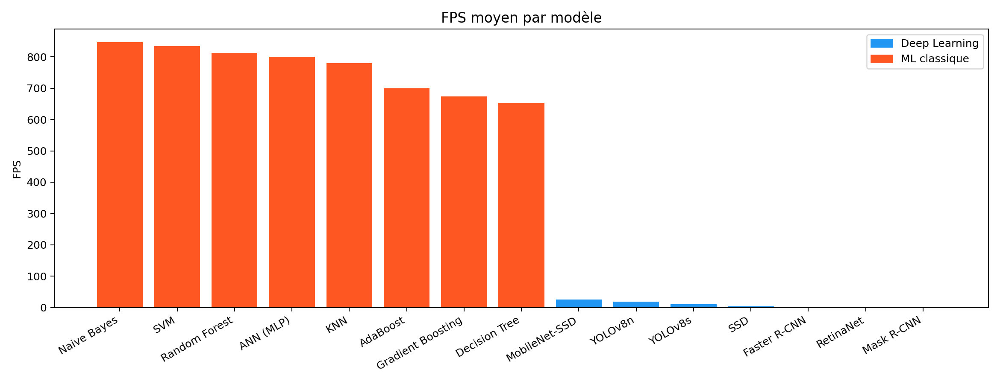

### Latence inférence
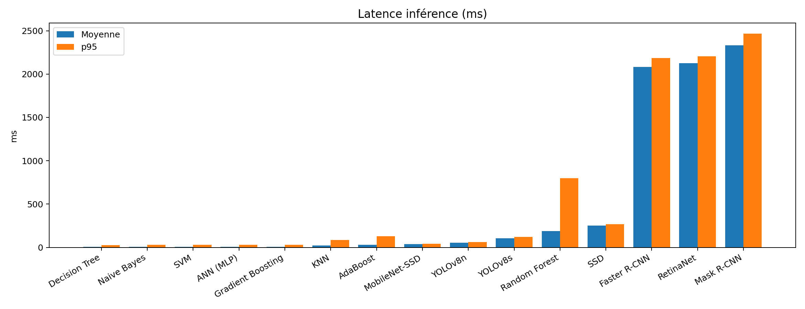

### Erreur comptage
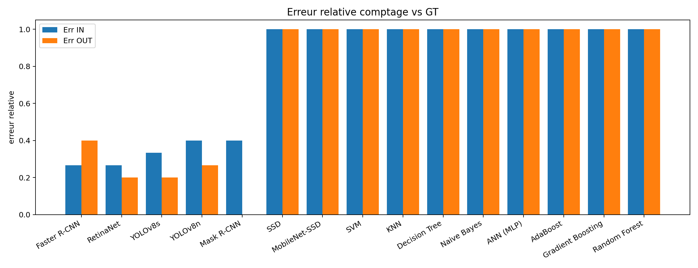

### Taux sans détection
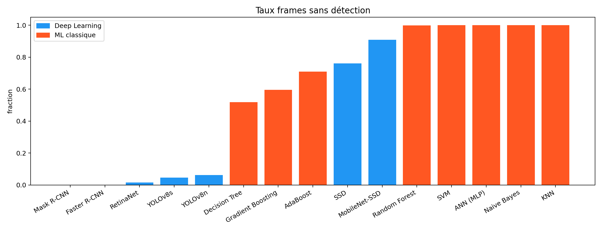

### Comptage prédit vs GT
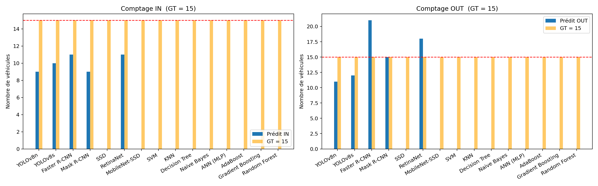

### MOTA vs MOTP
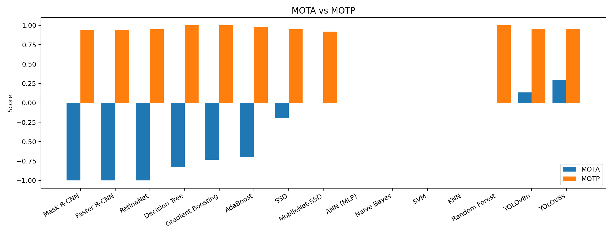

### MOTA bar
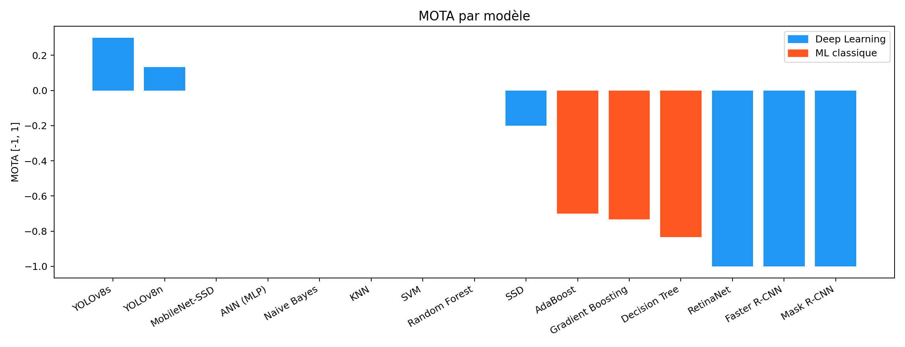

### F1 IN & OUT
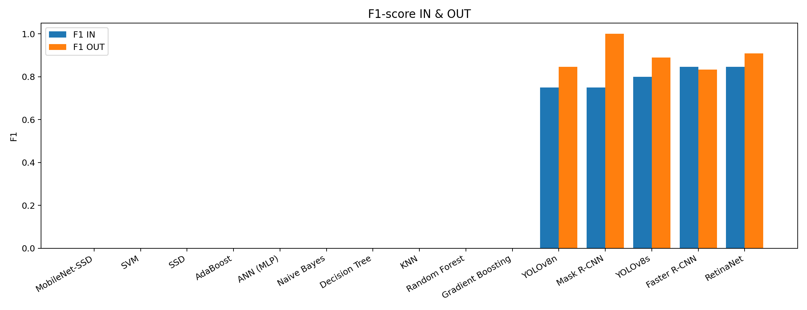

### Courbe IN
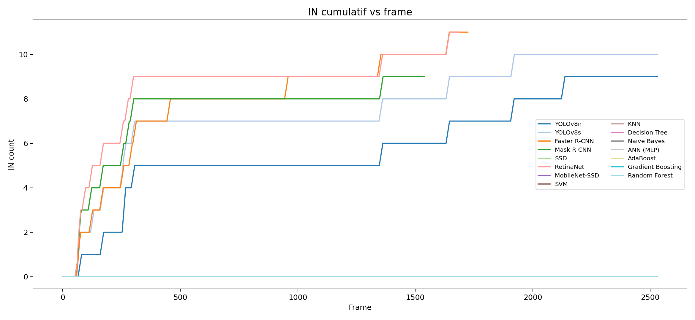

### Courbe OUT
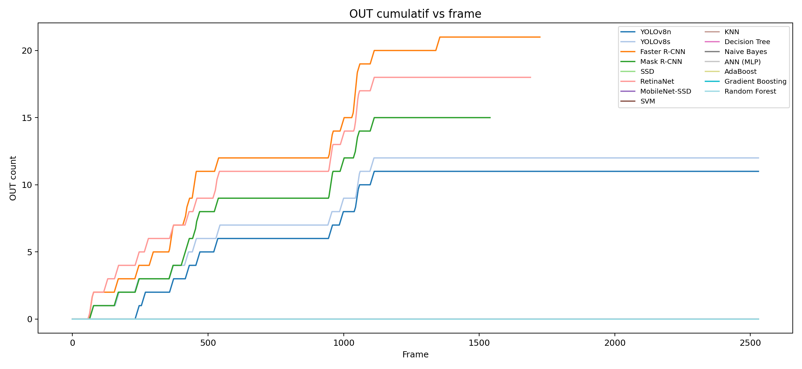

### FPS courbe
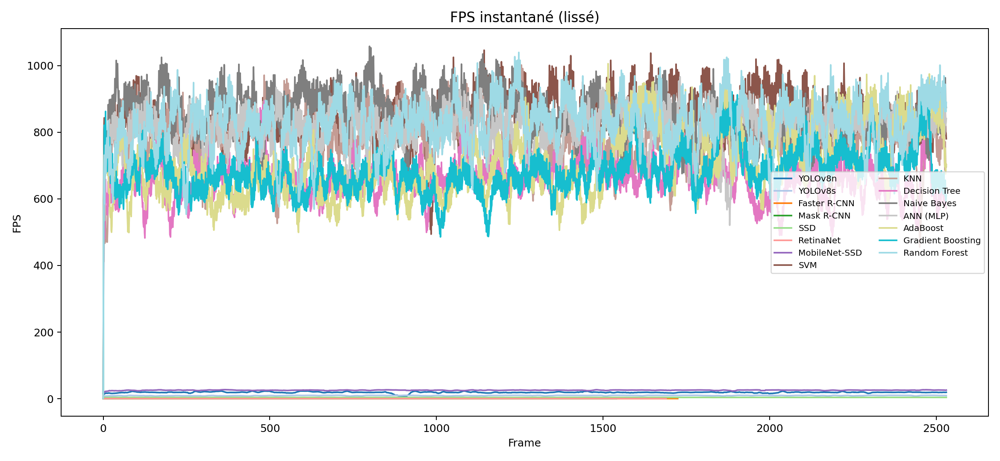

### Latence courbe
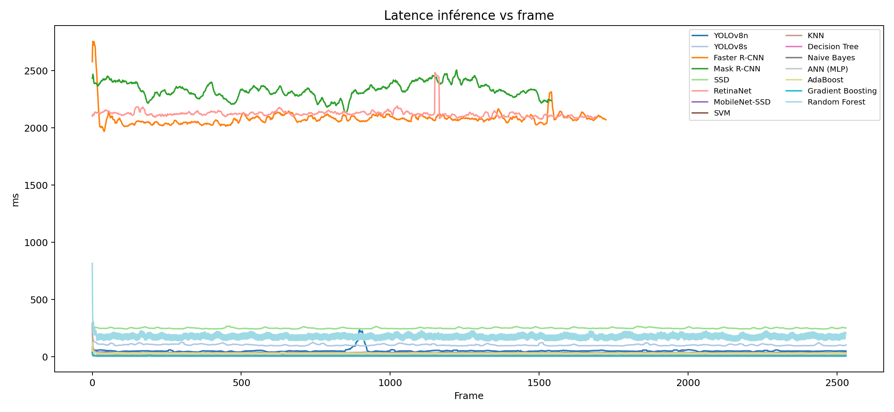

### Boxplot latence
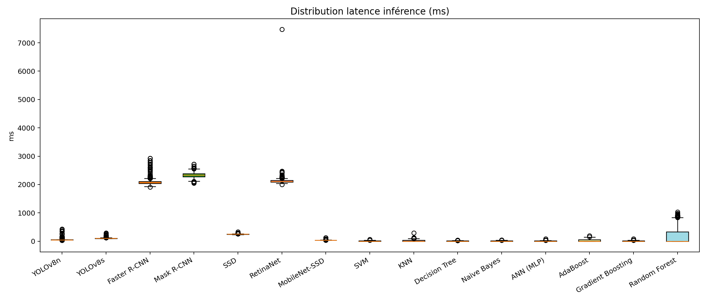

### Radar KPI
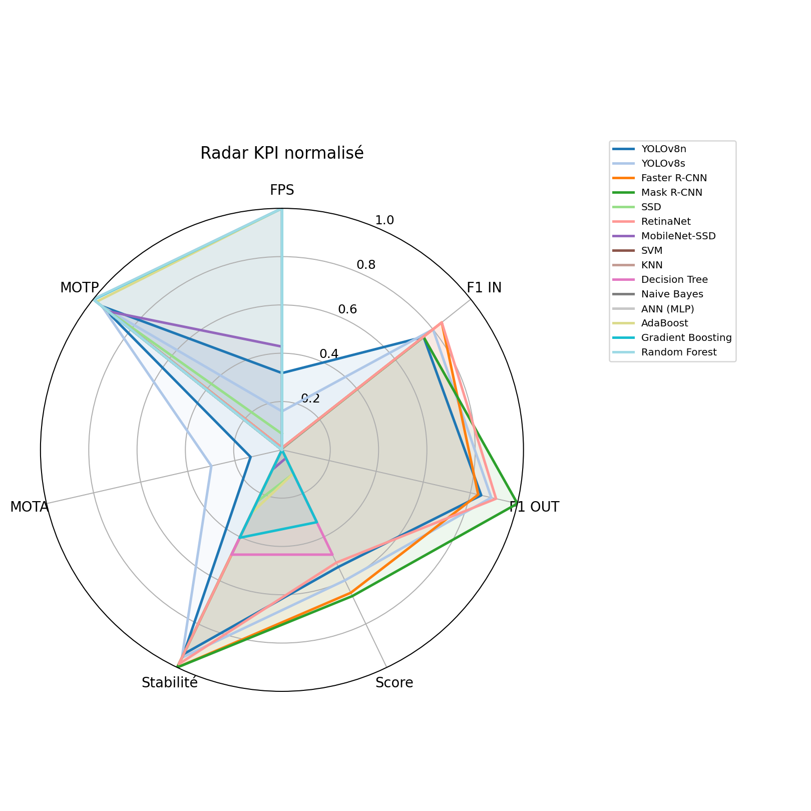

### Vitesse vs F1
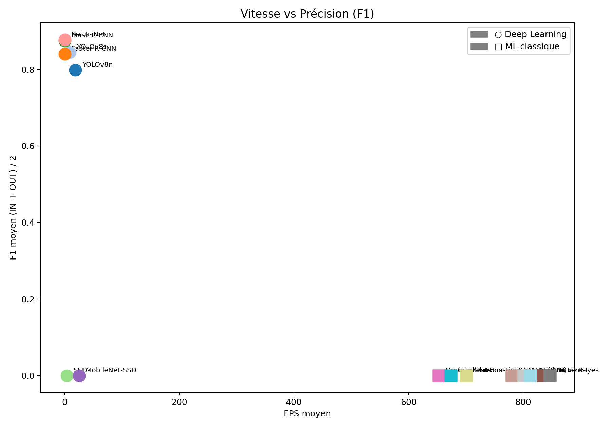

### Heatmap KPI
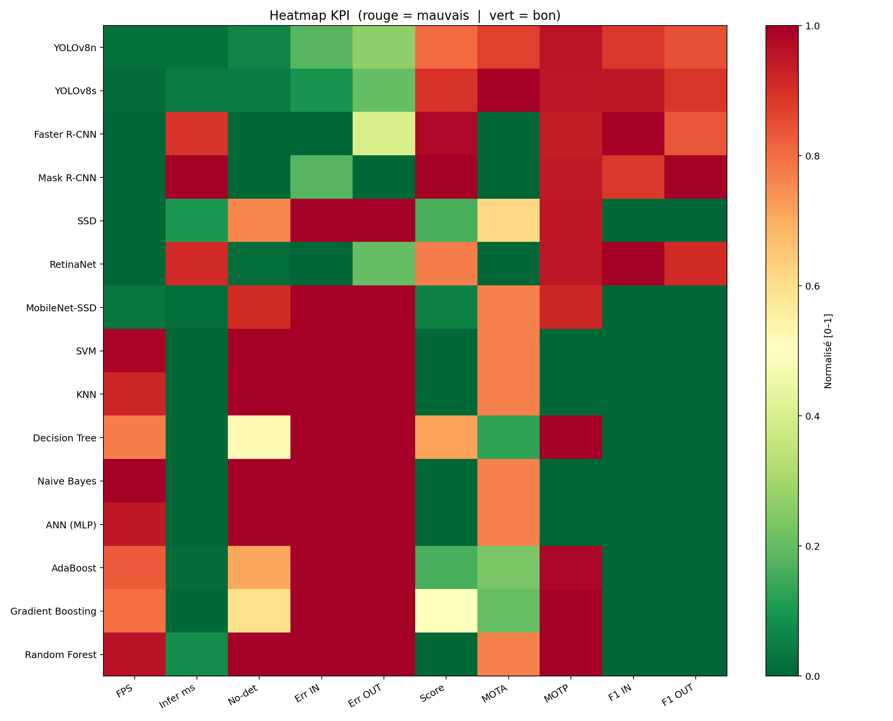

